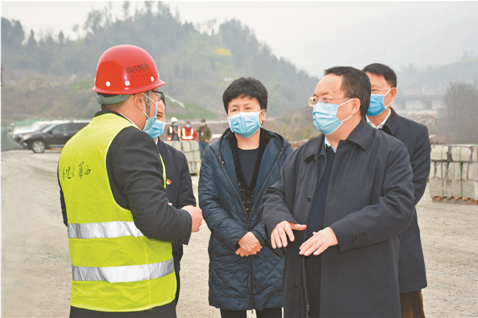

# Open-Ended Relational Query
Guide the on chain data retrieval process by providing explicit natural language instructions, via large multimodal models(LMMs) and large language models(LLMs). 

## Why we call it "Open-Ended"?
For information retrival, we want to get back information that matches data we inputed(e.g. images, texts).
Usually in this context, 'match' is used interchangeablly as "being similar/close". This is just too restrictful!

<p align="center">
    
    <p align="center"> Lake Titicaca -> What are other sight-seeings in the country? </p>
</p>
We want to express more search intents! To give you an idea, say you're in Lake Titicaca, you shoot and upload an image, hoping to know other great sight-seeings in the country where the lake locates, the desired result returned should not be those that are similar to Lake Titicaca, we want to query information not based on "being similar", so traditional information retrival system cannot handle our search requests in such cases.

In this project, we propose open-ended relational query, where the search intents (by texts) are explicitly incorporated into the query process thanks to the multi-modal integration we shall talk about below

## Query Process
### Intergrate Multiple Modalities
Specifically, to integrate multiple deep modalities, we firstly apply CLIP to the text input and image query, resulting text embedding and vision embedding, which are then concatenated, 

<p align="center">
    
    <p align="center"> CLIP: Text Encoder and Vision Encoder </p>
</p>

To further fuse the two embeddings, multiple self attention layers and another multi head attention pooler are employed to consecutively compress the multimodal inputs into a single embedding, let's call it **r** and this is our final embedding for the query.

<p align="center">
    
    <p align="center"> Fusion and Compression for multi-modal embeddings </p>
</p>

### Build Index Service for Targets
What should be return for query requests? Ideally, we'll crawl images across the blockchain ledger, for each image, we add a default dummy text "" along with it and feed them to the two way encoders to get the final embedding, which we call r_t, we then store all the embeddings and build a KNN service that you can query into, the KNN service will then give back k nearest neighrbors in the embedding space. To know more index building, refer to folder **index_building**, if you also want to dive deep into the way the backend hosting the Index Service, you can go to the folder **clip_index__back**.

### Start Services
A utility script **run.sh** is provided to start the query service locally.

```shell
# open a terminal, run
sh run.sh
```

## About this project
### Team
AirMug (aka flying_dumplings): An AI R&D Engineer with more than 5 years of experience. I built projects that really served people and industries like Renewable Energy, Healthcare, Electronics, Agriculture, just to name a few. Focusing on AIGC and its applications in a Decentralized manner, in the sense of academics, also quite into GNN these days. 

### Demo

<p align="center">
    
    <p align="center"> demo: returned images are relevant to our search intent </p>
</p>

When we provide the image of a panda and ask, where does it live? The images returned are mostly China related.

<p align="center">
    
    <p align="center"> A correct target, though the information granularity is a little coarse  </p>
</p>

In one image there is a man wearing a jacket and a helmet, on the jacket is the text "huaxi", which in English means "Western China", on the helmet is "Szechuan", it's exactly where pandas live!!!
Below are images that are Szechuan related! which examplifies that we can provide really fine-grained information retrieval.
<p align="center">
    
    <p align="center"> demo: even the text on the image is relavant! </p>
</p>

<p align="center">
    
    <p align="center"> Szechuan Cuisine!  </p>
</p>

### History of participation in other hackthons
None, it's a new project.

### History of awards/grants/funding
None for a new project.

## Issues and What next
### Performance Improvements
The index laion5B was offline, we use a much much smaller version of index, datacomp_small_12m thanks to **Fondant**, as you can tell from the names, it's 5B versus 12m (only 9m used).
We expect the performance would be much better if laion5B would be back online in the near future. If we plan to craws all data across a blockchain ledger, which would require much better computation resources, your grant will definitely help!

### Better UI/UX
Due to the time constraint, we don't devote much time on the UI/UX, we expect a much better experience for users.

### More Modalities
In this project, we use text and vision to show our ability to do multi-modal retrieval, but we strongly believe this project can be extended to other modalities like audio, point cloud etc. 

### Cross-Chain Infrastructure
Information retrieval by nature is platform agnostic, we hope multi-modal or open-ended information retrival can serve as a shared infrastruture for all blockchains. This is not a deviation from Decentralization, but to make our service available to as broader as possible users which echoes Decentralization.